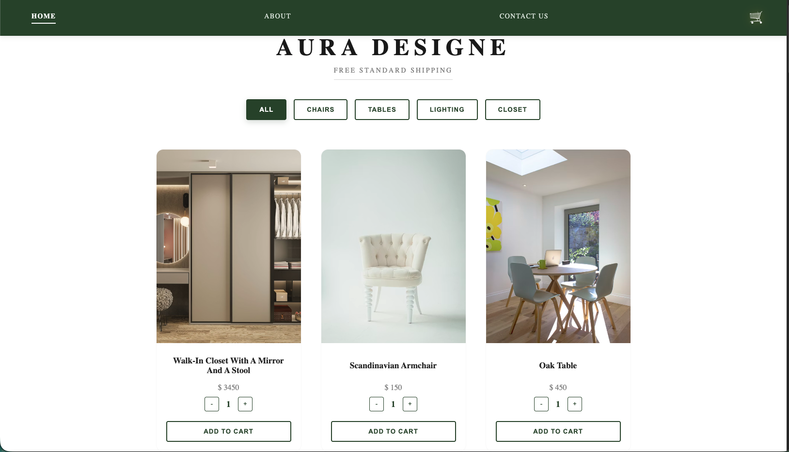

# 🪑 Aura Design - Furniture E-commerce Store

**Aura Design** is a modern and minimalist furniture e-commerce web application built with React and Redux Toolkit. It features a sleek user interface, dynamic category filtering, and a fully functional shopping cart system.

## 🌐 Live Demo

You can explore the live version of the project here:

**👉 [View Live Project](https://auradesigne.netlify.app/)**

---

## 📸 Preview



## ✨ Features

* 🛋️ **Product Catalog:** Browse a wide range of furniture items including chairs, tables, lighting, and closets.
* 🔍 **Dynamic Filtering:** Filter products by category (Chairs, Tables, Lighting, Closet) with an "All" option to view the full collection.
* 🛒 **Shopping Cart (Redux-powered):**
    * ➕ Add items to the cart with a specific quantity.
    * 🔢 Automatic subtotal calculation for each item (Quantity × Price).
    * 🔔 Real-time "Cart Badge" in the Navbar showing the total number of items.
    * 🗑️ Full cart management: Remove items and view the final total amount.
* 📱 **Responsive Design:** Optimized for both desktop and mobile devices.
* ✉️ **Contact System:** A dedicated contact page with a stylized form and business information.

## 🛠 Tech Stack


## 🚀 Getting Started

To run this project locally, follow these steps:

1.  **Clone the repository:**
    ```bash
    git clone https://github.com/NataliiaLitskevych/aura-designe.git
    ```

2.  **Navigate into the project directory:**
    ```bash
    cd aura-design
    ```

3.  **Install dependencies:**
    ```bash
    npm install
    ```

4.  **Start the development server:**
    ```bash
    npm start
    ```

## 📂 Project Structure

* 🧱 `src/Components` — Reusable UI components like `Footer`, `Buttons`, and `FurnitureItem`.
* 📄 `src/Pages` — Main views: `Shop`, `About`, `Contact`, and `Cart`.
* ⚡ `src/Redux` — Redux store configuration and `cartSlice` logic.
* 📊 `src/data` — Centralized data file containing furniture product details.

## 🎨 UI & UX Highlights

* **Navbar:** Features a sticky header with a high-contrast dark-green background and an interactive yellow cart badge.
* **Filter Buttons:** Use a distinct active state (dark-green background with white text) to clearly show the selected category.
* **Product Cards:** Clean layouts with hover effects and easy-to-use quantity selectors.

---
Developed with ❤️ by Nataliia Litskevych

[](https://www.linkedin.com/in/nataliia-litskevych)
[](https://github.com/NataliiaLitskevych)
